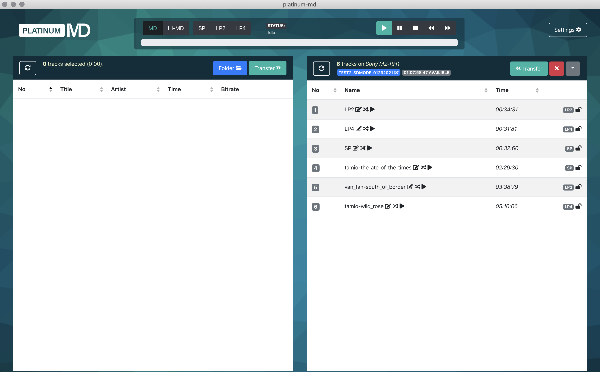
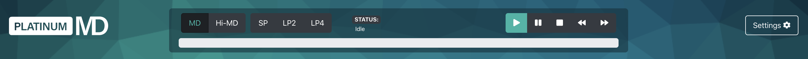
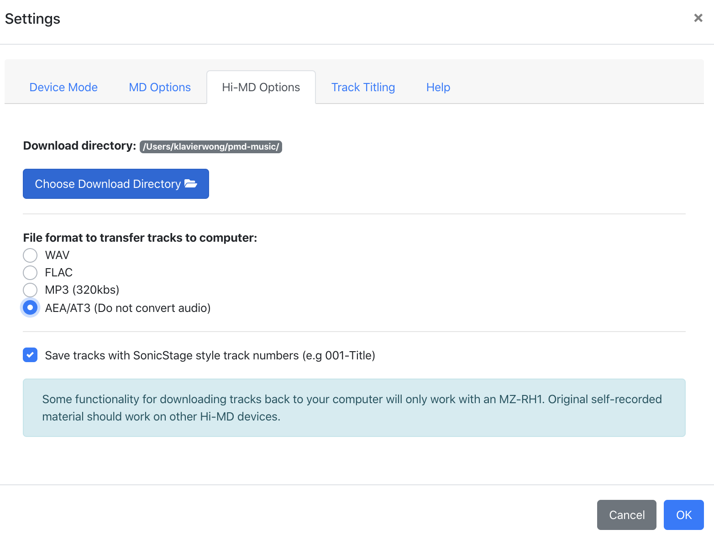
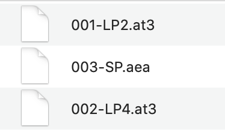
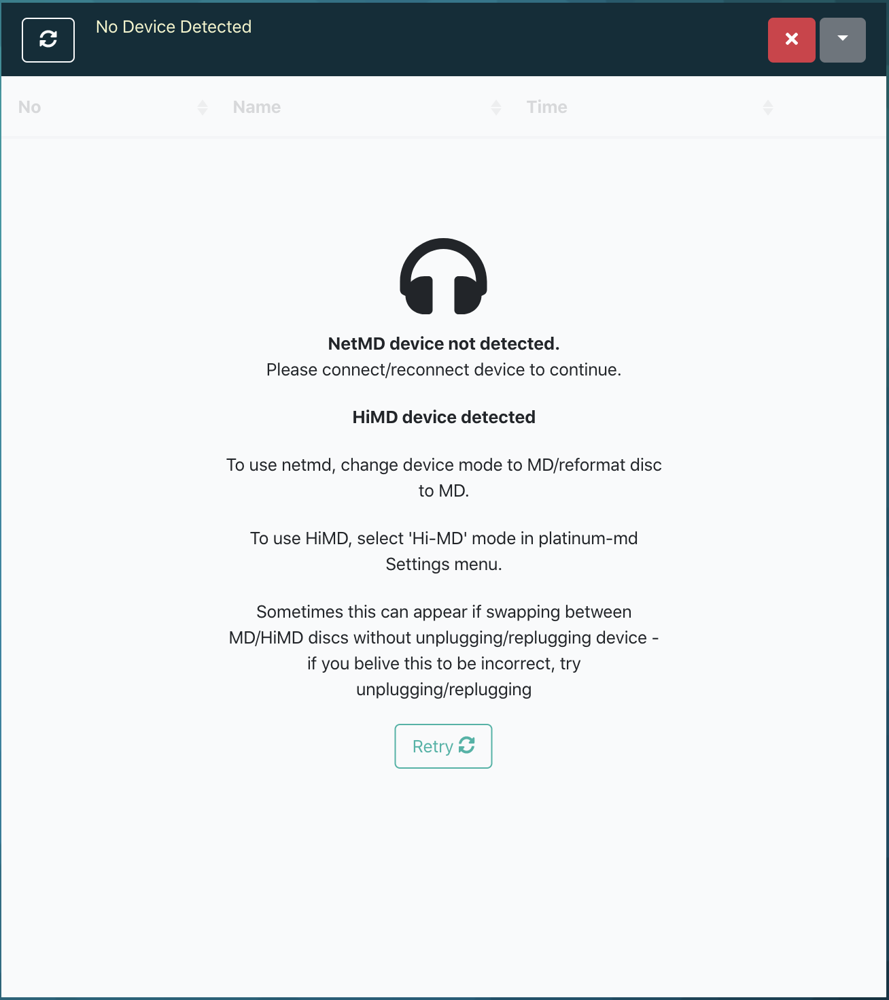
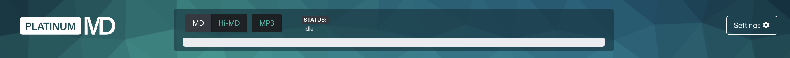
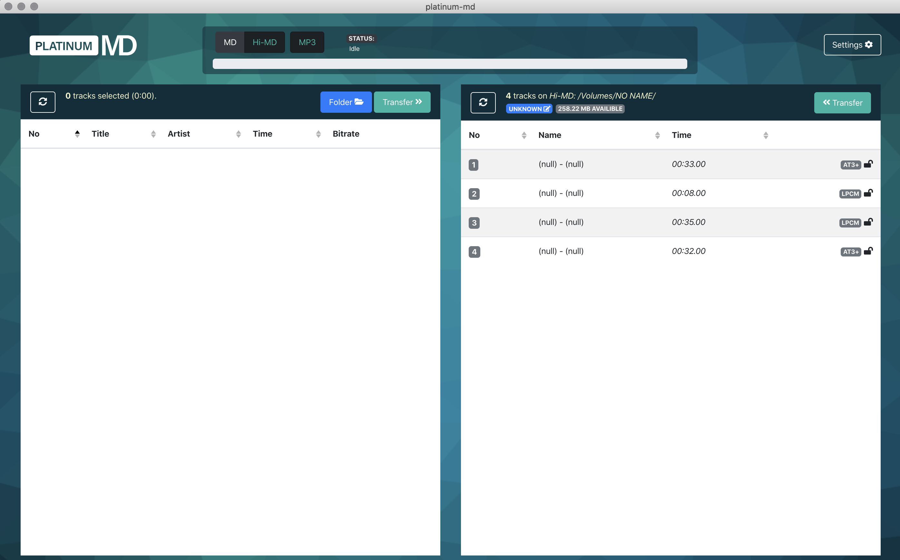
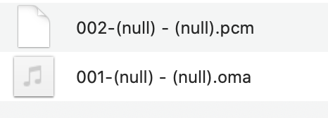

# (still experimenting) Use Platinum-MD to retrieve audio tracks in its original ATRAC format #

The workflow below is still under experimenting. 

[Platinum-MD](https://github.com/gavinbenda/platinum-md.git) is a project aims to make uploading audio files to NetMD players seamless and automatic. It is also a project based on the linux-minidisc codes. Platinum-MD has both [GitHub source codes](https://github.com/gavinbenda/platinum-md.git) and [GUI-software](https://platinum-md.app) for direct download. Originally, it was designed for uploading audio tracks from local computers to NetMDs without involving any proprietary software such as SonicStage. Lately, [a latest version](https://github.com/gavinbenda/platinum-md/releases/tag/v1.0.0-RC1) is pre-released, bringing forth a set of new features including compatibility with Hi-MD and allowing uploading audio tracks from MD to computer. 

The tests I made below is based on the latest pre-released v1.0.0-RC1 version.

## My Equipment ##
* iMac (macOS Catalina version 10.15.7) 
* *homebrew* and *ffmepg* installed
* Sony MZ-M200 Hi-MD recorder-player
* USB 2.0 port to connect MD with Mac
* Several standard MD discs and Hi-MD discs with protected and unprotected audio information recorded in SD, LP2, LP4 and Hi-MD modes.

## Set up ##
* In Terminal, type
```bash
brew install --force pkg-config qt5 mad libid3tag libtag glib libusb libusb-compat libgcrypt ffmpeg json-c && brew link --force qt5
```

* Download the Platinum-MD .dmg file. [Latest version here](https://github.com/gavinbenda/platinum-md/releases/tag/v1.0.0-RC1)
*(or direct download [here](https://github.com/gavinbenda/platinum-md/releases/download/v1.0.0-RC1/platinum-md-1.0.0.dmg))*
* Open the .dmg file. Drag the file to the applications folder.
* Remember to allow your system to open the application by setting up the `Security & Privacy`
* Once Platinum-MD is installed, you can open it like opening any other applications.


## How-Tos ##


## Standard MD ##
* Once you insert your disc, mount your MD player to your computer, and open the Platinum-MD software, the software should be able to locate the MD player and read the disc like this:



* To process a disc formatted in standard mode, remember to set Platinum-MD in the `MD` mode (at the top bar).




* Open `settings`, click `Hi-MD options` (*yes, even though you are not processing a Hi-MD*). 
* Under `File format to transfer tracks to computer`, choose `AEA/AT3(Do not convert audio)`. 
* Choose the directory you wish you save your transferred audio tracks. Click `OK`.




* Back to the main interface, on the right-hand-side, select the tracks you want to transfer to your computer.
(*make sure the tracks are `unlocked`*)
* Click `<<Transfer`, and the transfer process will commence.


* Once the transfer process is completed, at your destination directory , the transferred tracks will be placed in a file folder with the same title as the disc.

* `SP-mode` recorded tracks will be saved as `.aea` format. `LP2` and `LP4` recorded tracks will be saved as `.at3` format (means ATRAC3).

(*ffprobe is able to identify the atrac and atrac3 codec along with other technical metadata, such as sampling rate and bit rate*)
(*to play files in .aea and .at3 formats, VLC is a good bet.*)




## Hi-MD ##
**According to Platinum-MD developers, Hi-MD functionality is still experimental. ONLY USE FOR DISCS YOU ARE PREPARED TO ERASE (OR TO PLAY AROUND WITH). Renaming/erasing tracks/discs is currently not supported for Hi-MD.**


* Insert your Hi-MD disc, mount your MD player to your computer, and open the Platinum-MD software, the software might NOT be able to detect the device at once, like this:




* As Platinum-MD defaults the device as NetMD, so you need to click `Hi-MD` mode at the top bar. 




* Once you set Platinum-MD into Hi-MD mode, it should be able to recognize the device connection, like this:



* (*at this point, unfortunately you cannot edit the title of the disc and the tracks as the Hi-MD mode is still under developing.*)

* Open `settings`, click `Hi-MD options`. 
* Under `File format to transfer tracks to computer`, choose `AEA/AT3(Do not convert audio)`. 
* Choose the directory you wish you save your transferred audio tracks. Click `OK`.

* Back to the main interface, on the right-hand-side, select the tracks you want to transfer to your computer.
(*make sure the tracks are `unlocked`*)
* Click `<<Transfer`, and the transfer process will commence.

* Once the transfer process is completed, at your chosen destination, the transferred tracks will be placed in a file folder with the same title as the disc.
* Hi-MD-uncompressed recorded tracks will be saved as .pcm format. Hi-SP and Hi-LP recorded tracks will be saved as .oma format (ATRAC3 plus).



(*to play .oma file, VLC works. But for .pcm format, Adobe Audition seems the only choice.*)


## Troubleshoot ##
* troubleshoots of installation could be found [here](https://github.com/gavinbenda/platinum-md#troubleshooting), but these problems are more NetMD oriented

* **The operation of this latest version Platinum-MD is still a bit wobbly. Sometimes, after you transfer your first batch of tracks, the software would freeze. At this point, close the software and unplug the MD player from the computer. Then again mount the MD player to the computer and restart Platinum-MD. Things will get back to normal. This situation tends to occur to both standard MD and Hi-MD modes.**

