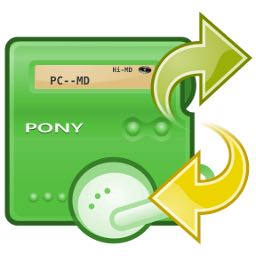

# Hi-MD #
This is a testing project for retrieving digital contents stored in Hi-MD formatted MiniDiscs and transferring to my local Mac computer. This project is based on the scripts from the [linux-minidisc](https://wiki.physik.fu-berlin.de/linux-minidisc/doku.php?id=start) and the application tool [QHiMDTransfer](https://wiki.physik.fu-berlin.de/linux-minidisc/doku.php?id=qhimdtransfer). 

In particular, the application tool QHiMDTransfer is supposed to be a simple clone of the Mac OS X software [HiMD Music Transfer for Mac 2.0](https://www.sony.com/electronics/support/downloads/W0002236), which is the Sony proprietary software for MiniDisc users to transfer audio information between Hi-MD player and Mac computer. This software was accompanied with a Hi-MD player when a consumer purchases a set of the product. Unfortunately, the original "HiMD Music Transfer" software is only compatible with the Mac OS X version 10.3.9 through 10.4. 

With the development of the [QHiMDTransfer](https://wiki.physik.fu-berlin.de/linux-minidisc/doku.php?id=qhimdtransfer) project, though still at a rudimentary stage, provides to nowadays MiniDisc users a flexible approach to retrieve the stored information. The QHiMDTransfer application is open-source, compatible with Windows, Mac and Linux systems. This is exceptionally useful to archivists working in cultural institutions.


## My Equipment ##
* iMac (macOS Catalina version 10.15.7) 
* Sony MZ-M200 Hi-MD recorder-player
* USB 2.0 port to connect MD with Mac
* Several standard MD discs and Hi-MD discs with protected and unprotected audio information recorded in SD, LP2, LP4 and Hi-MD modes.


## Set Up ##
* Download the whole set of codes in zip file from [here](https://github.com/thp/linux-minidisc/releases/tag/0.9.14.1) (download the Mac or Windows versions according to needs)
* Unzip the downloaded zip file (the file folder name looks like *"qhimdtransfer-0.9.14-4-gc4696f0-macos"*)
* Building and Running the dependencies (compilings for different operation systems, see [here](https://wiki.physik.fu-berlin.de/linux-minidisc/doku.php?id=start#building_and_running)
```bash
brew update
brew install --force qt5 mad libid3tag libtag glib libusb libusb-compat libgcrypt
brew link --force qt5
```

## How-to ##
* Insert the Hi-MD formatted disc into the MD player. The player will be switched on automatically
* Connect the MD player with the computer via USB port
* Open the *"qhimdtransfer-0.9.14-4-gc4696f0-macos"* file folder, and open the *"QHiMDTransfer"* executable program. (This is the GUI version)



