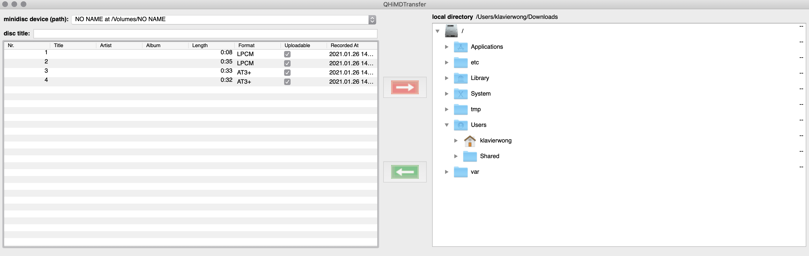
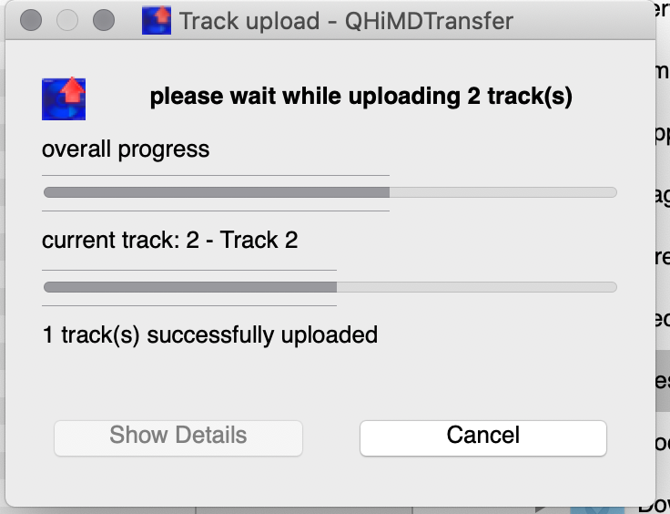
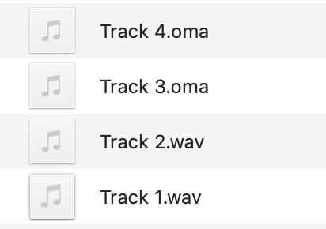

# Hi-MD #
This is a testing project for retrieving digital contents stored in Hi-MD formatted MiniDiscs and transferring to my local Mac computer. This project is based on the scripts from the [linux-minidisc](https://wiki.physik.fu-berlin.de/linux-minidisc/doku.php?id=start) and the application tool [QHiMDTransfer](https://wiki.physik.fu-berlin.de/linux-minidisc/doku.php?id=qhimdtransfer). 

In particular, the application tool QHiMDTransfer is supposed to be a simple clone of the Mac OS X software [HiMD Music Transfer for Mac 2.0](https://www.sony.com/electronics/support/downloads/W0002236), which is the Sony proprietary software for MiniDisc users to transfer audio information between Hi-MD player and Mac computer. This software was accompanied with a Hi-MD player when a consumer purchases a set of the product. Unfortunately, the original "HiMD Music Transfer" software is only compatible with the Mac OS X version 10.3.9 through 10.4. 

With the development of the [QHiMDTransfer](https://wiki.physik.fu-berlin.de/linux-minidisc/doku.php?id=qhimdtransfer) project, though still at a rudimentary stage, provides to nowadays MiniDisc users a flexible approach to retrieve the stored information. The QHiMDTransfer application is open-source, compatible with Windows, Mac and Linux systems. This is exceptionally useful to archivists working in cultural institutions.


## My Equipment ##
* iMac (macOS Catalina version 10.15.7) 
* *homebrew* and *ffmepg* installed
* Sony MZ-M200 Hi-MD recorder-player
* USB 2.0 port to connect MD with Mac
* Several standard MD discs and Hi-MD discs with protected and unprotected audio information recorded in SD, LP2, LP4 and Hi-MD modes.


## Set Up ##
* Download the whole set of codes in zip file from [here](https://github.com/thp/linux-minidisc/releases/tag/0.9.14.1) (download the Mac or Windows versions according to needs)
* Unzip the downloaded zip file (the file folder name looks like *"qhimdtransfer-0.9.14-4-gc4696f0-macos"*)
* Building and Running the dependencies (compilings for different operation systems, see [here](https://wiki.physik.fu-berlin.de/linux-minidisc/doku.php?id=start#building_and_running)
```bash
brew update
brew install --force qt5 mad libid3tag libtag glib libusb libusb-compat libgcrypt
brew link --force qt5
```

## How-to ##
* Insert the Hi-MD formatted disc into the MD player. The player will be switched on automatically
* Connect the MD player with the computer via USB port
* Because Hi-MD is not only compatible with audio information storage, but also can save non-audio digital files, at this point, the MD player is mounted to the computer as an external drive

* Open the *"qhimdtransfer-0.9.14-4-gc4696f0-macos"* file folder, and open the GUI *"QHiMDTransfer"* executable program. (*Security and Privacy setting may need to change in order to open the application*)


* The GUI version of the application looks like this:


* The GUI shows the number of tracks, length, recording modes, protection status, and recording date and time. 
* On the left-hand side of the application, select the tracks you want to transfer. On the right-hand side, select the directory for saving the tracks.
* Hit the red arrow and start the transferring process.




## Results ##

* After transfer completes, in the destination destination, **tracks originally recorded in `lossless PCM mode` are wrapped in `.wav`**.

* After transfer complete, in the destination directory, **tracks originally recorded in `Hi-SP` and `Hi-LP` modes are wrapped in `.oma`**. 



* *MediaInfo* obtains the technical metadata of the .wav files like this:
```
Complete name                            : /Users/klavierwong/Desktop/No Name/Track 2.wav
Format                                   : Wave
File size                                : 5.96 MiB
Duration                                 : 35 s 434 ms
Overall bit rate mode                    : Constant
Overall bit rate                         : 1 411 kb/s

Audio
Format                                   : PCM
Format settings                          : Little / Signed
Codec ID                                 : 1
Duration                                 : 35 s 434 ms
Bit rate mode                            : Constant
Bit rate                                 : 1 411.2 kb/s
Channel(s)                               : 2 channels
Sampling rate                            : 44.1 kHz
Bit depth                                : 16 bits
Stream size                              : 5.96 MiB (100%)
```

* *MediaInfo* obtains the technical metadata of the .oma files like this:
```
Complete name                            : /Users/klavierwong/Desktop/No Name/Track 3.oma
Format                                   : OpenMG
File size                                : 263 KiB
Duration                                 : 25 s 168 ms
Overall bit rate                         : 85.6 kb/s

Audio
Format                                   : Atrac3
Format/Info                              : Adaptive Transform Acoustic Coding 3
Duration                                 : 25 s 168 ms
Bit rate                                 : 64.8 kb/s
Channel(s)                               : 2 channels
Channel layout                           : L R
Sampling rate                            : 44.1 kHz
Compression mode                         : Lossy
Stream size                              : 199 KiB (76%)
Encryption                               : SDMI
```

* **Notably, audio tracks originally recorded in Hi-SP and Hi-LP modes are supposed to be encoded in `atrac3 plus`, NOT atrac3. But after transfer, the .oma files show `atrac3` codec, which needs further examination.

### Troubleshoot ###

* If the above process fails to work for no obvious reason, try unplug the MD player from the computer, unload the disc, terminate the QHiMDTransfer, and re-connect and re-open everything again.
