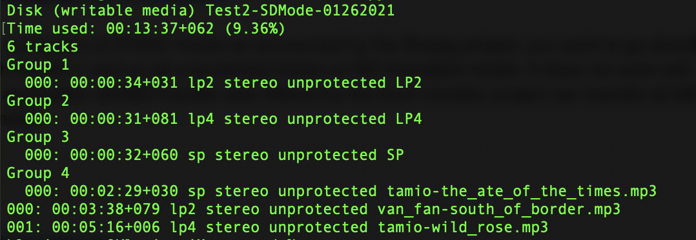
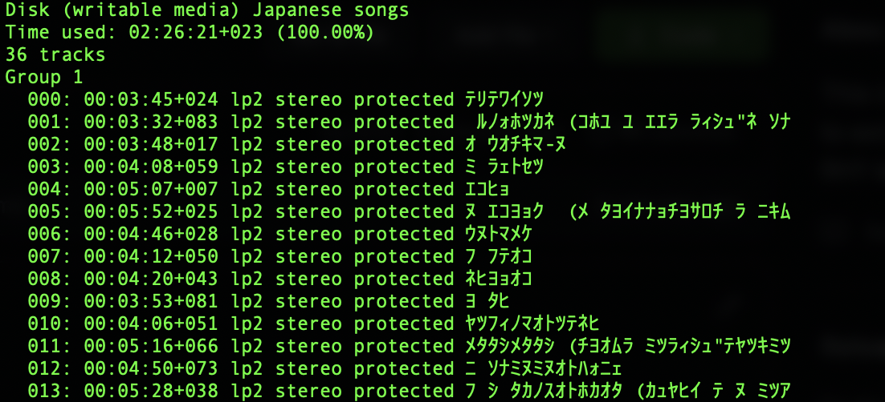
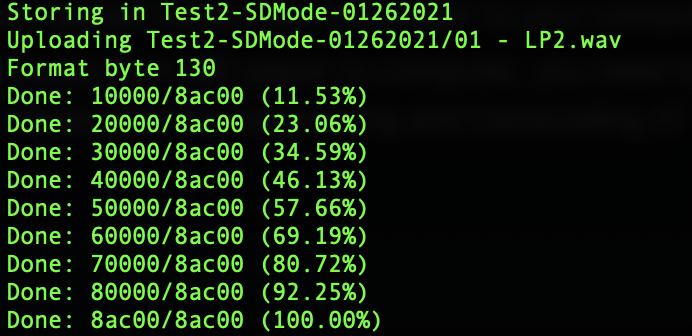
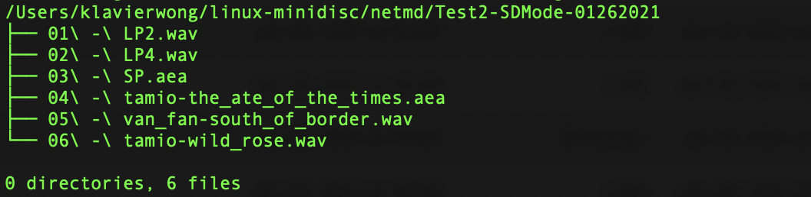

# Standard MD #

This is a walk-through of transferring digital contents stored in standard-MD formatted MiniDisc to local computer. The workflow is based on the linux-minidisc rooted [NetMDPython scripts](https://wiki.physik.fu-berlin.de/linux-minidisc/doku.php?id=netmdpython). The workflow below concentrates on operation in Mac OS system.

## Good to Know Before Started ##
The current NetMDPython are designed for NetMD devices. For now, they can work with *unprotected* audio tracks recorded in *non-Hi-MD modes*. It is found that, analog-recorded tracks are usually unprotected. All tracks uploaded by SonicStage are protected (back then, general users used SonicStage to transfer music into their players and make their mixtapes). Surprisingly, tracks uploaded by MD Simple Burner are not. 

As this file is designed for audiovisual archivists, and considering that MiniDisc archival collections usually store analog-input audio information (e.g. interview), there is good chance that contents would be mostly unprotected.

NetMDPython scripts with Hi-MD compatability are still under development. More discussion could be found [here](https://github.com/gavinbenda/platinum-md/issues/40) and [here](https://github.com/gavinbenda/platinum-md/issues/11).

For transferring Hi-MD formatted contents, you may follow along [here](Hi-MD.md)

## My Equipment ##
* iMac (macOS Catalina version 10.15.7) 
* *homebrew* and *ffmepg* installed
* Sony MZ-M200 Hi-MD recorder-player
* USB 2.0 port to connect MD with Mac
* Several standard MD discs and Hi-MD discs with protected and unprotected audio information recorded in SD, LP2, LP4 and Hi-MD modes.


## Workflow ##

### Set-up ###
* Download and install [Macports](http://www.macports.org).
* After installing macports, you'll need to modify your .bashrc in your home-directory by adding ”/opt/local/bin” to the PATH-environment. In the terminal (Applications→Utilities→Terminal), type: 
```bash
echo "PATH=$PATH:/opt/local/bin" >> ~/.bashrc
```
* Then install the ports *git-core* and *libusb* from Macports:
```bash
sudo port install libusb git-core py26-crypto sox
```
* Clone the codes with *git* into your local root directory. 
``` bash
git clone https://github.com/glaubitz/linux-minidisc/
```
* Insert MD disc into MD player (the player should be switched on automatically).
* Connect MD player with Mac via a USB port.
* In Terminal, type:
``` bash
cd linux-minidisc/netmd
```
(The Python *libnetmd* can be found in the *netmd* subdirectory in the "linux-minidisc" folder)

### How-to List Contents ###
* To list what you have in the MD disc, type:
``` bash
./lsmd.py
```
* The content list will contain total number of recorded tracks, track titles and time-stamps, protection status, and track recording modes.

* The outcome will look like:



* If protected contents are included (e.g. those imported through SonicStage), the outcome will look like:




### How-to Upload Contents from MD to Computer ###
* Using, Sony's MZ-RH1/M200, you can upload tracks from MD player to your computer.
* Before you can successfully upload tracks from MD player to computer, you need to install FFmpeg (an open-source media encoding and processing application), which will be used for regconizing and transcoding ATRAC information.
* To install FFmpeg, 
``` bash
sudo port install ffmpeg-devel
```
(if FFmpeg is already installed in your computer, skip this step.)

* To upload unprotected audio tracks from MD disc to computer by using Sony's MZ-RH1/M200:
``` bash
./upload.py
```
(protected tracks will be skipped automatically)

* The uploading process will look like this:




## Results ##

* Upon retrieving the tracks, they will be saved in a subfolder under the *netmd* directory. 

* **Tracks originally recorded in SP mode are wrapped as .aea format (in atrac1 codec). 

* **Tracks originally recorded in LP2/LP4 modes are wrapped in .wav format (in atrac3 codec). 
(*MediaInfo* or *ExifTool* are not able to identify the atrac1 codec. But *FFProbe* does; Both *MediaInfo* and *FFprobe* can identify the atract3 codec.)

* The uploaded tracks saved in your destination directory will be in this structure:




* *FFprobe* shows .aea file (tracks recorded in SP mode) technical metadata like this:
```
 Duration: 00:00:32.72, bitrate: 292 kb/s
    Stream #0:0: Audio: atrac1, 44100 Hz, stereo, fltp, 292 kb/s
 ```

* *MediaInfo* shows .wav (tracks recorded in LP2 and LP4 modes) technical metadata like this:
```
Complete name                            : /Users/klavierwong/Downloads/Test2-SDMode-01262021/002-LP4.at3
Format                                   : Wave
File size                                : 258 KiB
Duration                                 : 31 s 953 ms
Overall bit rate                         : 66.2 kb/s
IsTruncated                              : Yes

Audio
Format                                   : Atrac3
Format/Info                              : Adaptive Transform Acoustic Coding 3
Codec ID                                 : 270
Codec ID/Hint                            : Sony
Duration                                 : 31 s 953 ms
Bit rate                                 : 66.1 kb/s
Channel(s)                               : 2 channels
Sampling rate                            : 44.1 kHz
Compression mode                         : Lossy
Stream size                              : 258 KiB (100%)
```


* **As shown above, the SP tracks will be put into an .aea wrapper with atrac1 codec. LP2/LP4 tracks are wrapped in .wav but the codec reads atrac3, which means there’s no generational loss. This also means that, with the atrac1 and atrac3 codecs in the tracks, audio players with atrac-encoding scheme are required to play back the tracks. FFmpeg and VLA are good choices.**


### Troubleshoot ###

* If the above command-lines fail to work for no obvious reason, try unplug the MD player from the computer, unload the disc, terminate the Terminal, and re-connect everything again.
